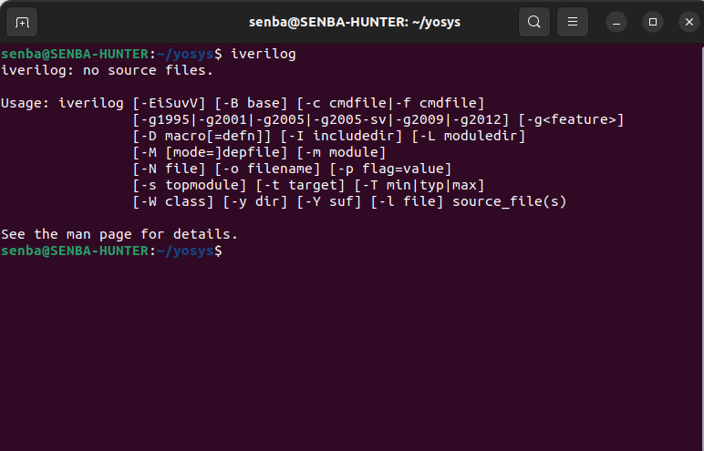
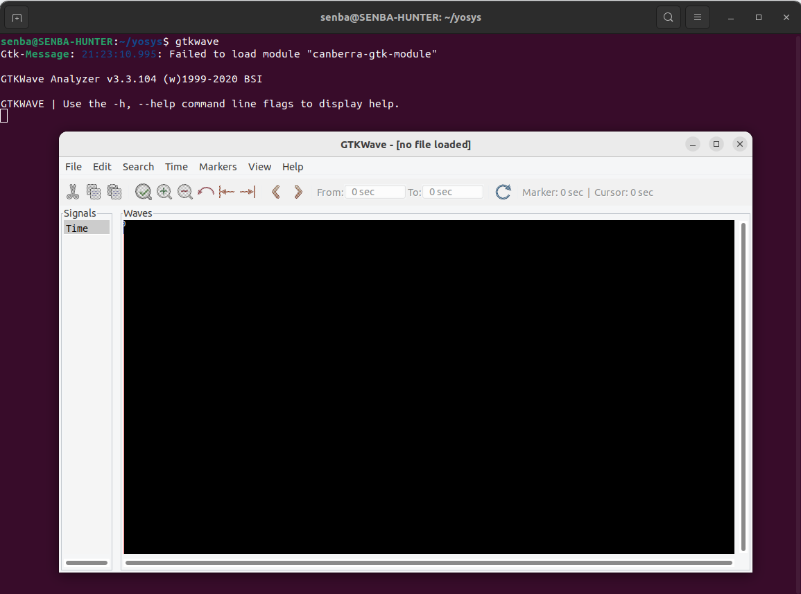
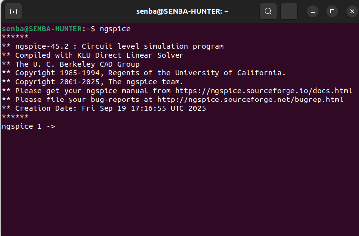
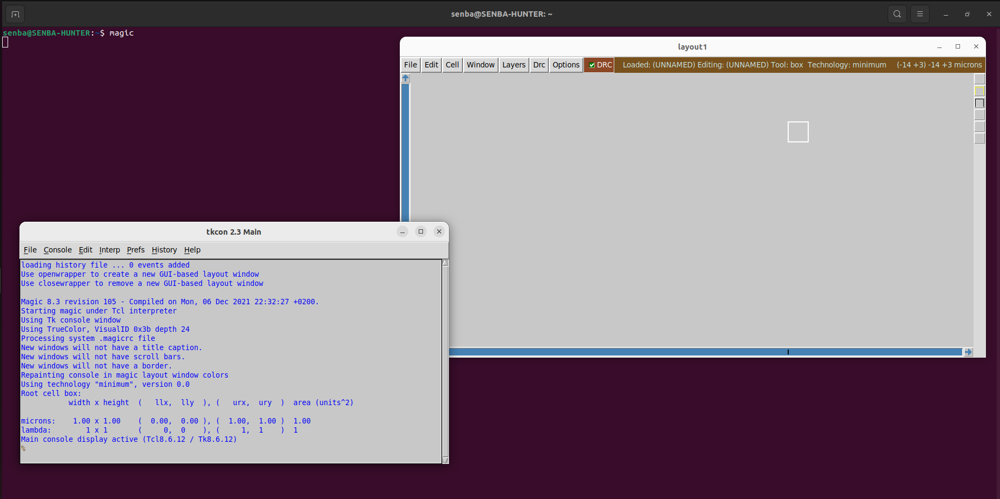

# ⚙️ VSD Program – Tools Installation Guide  

<div align="center">

🌐 **One place for all your VLSI tool setup needs**  

✨ Smooth Installation · ⚡ Optimized Performance · 🛠️ Ready for Design  

</div>  

---

## 🖥️ **Before You Begin – System Checklist**  

Make sure your system is ready for synthesis, simulation, and layout by meeting the **minimum hardware/software requirements** below:  

<div align="center">

| 🔧 **Component** | ✅ **Recommended Setup** |
|------------------|--------------------------|
| 🐧 **OS**        | Ubuntu 20.04 LTS or newer |
| 💾 **Memory**    | 6 GB (8 GB+ preferred 🚀) |
| 💿 **Disk**      | 50 GB free storage |
| ⚡ **CPU Cores** | 4 vCPUs (multi-core boosts speed) |

</div>  

---

# 📂 Installation Instructions  

All detailed steps for installing **Yosys**, **Iverilog**, **GTKWave**, **Ngspice**, and **Magic VLSI** can be found in the upcoming sections.  

---

### 🧠 **1. Yosys – RTL Synthesis Tool**

<details>
<summary><b>Purpose:</b> Converts RTL code into gate-level representations.</summary>

</details>
Yosys is an open-source framework for Verilog RTL synthesis, offering algorithms and optimization passes to transform RTL into gate-level netlists for further simulation and physical design.

---

## ✅ **Yosys Installation**

```bash
# Day 0 - Tools Installation
## Yosys

# Clone Yosys repository
$ git clone https://github.com/YosysHQ/yosys.git
$ cd yosys 

# Install make (if not installed)
$ sudo apt install make 

# Install dependencies
$ sudo apt-get install build-essential clang bison flex \
    libreadline-dev gawk tcl-dev libffi-dev git \
    graphviz xdot pkg-config python3 libboost-system-dev \
    libboost-python-dev libboost-filesystem-dev zlib1g-dev

# Configure build with GCC
$ make config-gcc

# Initialize Git submodules (required for abc)
$ git submodule update --init --recursive

# Build Yosys
$ make 

# Install Yosys
$ sudo make install
```

## 📷 **Installation Verification**

```bash
# Run Yosys after installation
$ yosys
```

<p align="center">
  
</p>

<div align="center">

✅ **Yosys Successfully Installed**

</div>

### 🧠 **2. Iverilog – Verilog Simulator**

<details>
<summary><b>Purpose:</b> Compiles and simulates Verilog designs for functional verification.</summary>

</details>
Iverilog is an open-source Verilog simulation and compilation tool. It allows you to compile Verilog code into executable simulations and run functional verification of your designs before synthesis.

---

## ✅ **Iverilog Installation**

```bash
# Install Iverilog
$ sudo apt-get install iverilog
```

## 📷 **Installation Verification**

```bash
# Run Iverilog after installation
$ iverilog 
```

<p align="center">
  
</p>

<div align="center">
  ✅ <b>Iverilog Successfully Installed</b>
</div>

### 🧠 **3. GTKWave – Waveform Viewer**

<details>
<summary><b>Purpose:</b> Analyzes and visualizes simulation waveforms for debugging.</summary>

</details>
GTKWave is an open-source waveform viewer used to analyze and visualize simulation outputs from Verilog and VHDL. It helps in debugging designs by displaying signal waveforms clearly.

---

## ✅ **GTKWave Installation**

```bash
# Update packages
$ sudo apt update

# Install GTKWave
$ sudo apt install gtkwave
```

## 📷 **Installation Verification**

```bash
# Run GTKWave after installation
$ gtkwave 
```
<p align="center">
  
</p>

<div align="center">
  ✅ <b>GTKWave Successfully Installed</b>
</div>

### 🧠 **4. NGSpice – Circuit Simulator**

<details>
<summary><b>Purpose:</b> Simulates analog and digital circuits for analysis and verification.</summary>

</details>
NGSpice is an open-source mixed-level/mixed-signal circuit simulator. It allows you to perform transient, AC, DC, and other analyses on your electronic circuits for verification and debugging.

---

## ✅ **NGSpice Installation**

```bash
# Download and unpack NGSpice tarball (assuming ngspice-37.tar.gz)
$ tar -zxvf ngspice-37.tar.gz
$ cd ngspice-37

# Create build directory
$ mkdir release
$ cd release

# Configure build with X11 support and readline
$ ../configure --with-x --with-readline=yes --disable-debug

# Build NGSpice
$ make

# Install NGSpice
$ sudo make install
```
## 📷 **Installation Verification**

```bash
# Run NGSpice after installation
$ ngspice 
```

<p align="center">
  
</p>

<div align="center">
  ✅ <b>NGSpice Successfully Installed</b>
</div>

### 🧠 **5. Magic VLSI – Layout Tool**

<details>
<summary><b>Purpose:</b> Creates, edits, and analyzes VLSI layouts with DRC capabilities.</summary>

</details>
Magic VLSI is an open-source VLSI layout tool widely used for IC design, design rule checking (DRC), and visualization. It allows designers to create, edit, and verify integrated circuit layouts efficiently.

---

## ✅ **Magic VLSI Installation**

```bash
# Install required dependencies
$ sudo apt-get install m4
$ sudo apt-get install tcsh
$ sudo apt-get install csh
$ sudo apt-get install libx11-dev
$ sudo apt-get install tcl-dev tk-dev
$ sudo apt-get install libcairo2-dev
$ sudo apt-get install mesa-common-dev libglu1-mesa-dev
$ sudo apt-get install libncurses-dev

# Clone Magic repository
$ git clone https://github.com/RTimothyEdwards/magic
$ cd magic

# Configure build
$ ./configure

# Build Magic
$ make

# Install system-wide
$ sudo make install
```
## 📷 **Installation Verification**

```bash
# Run Magic after installation
$ magic 
```

<p align="center">
  
</p>

<div align="center">
  ✅ <b>Magic VLSI Successfully Installed</b>
</div>

### 🧠 **6. Tool Versions**

<details>
<summary><b>Purpose:</b> Check installed versions of essential tools for VSD setup.</summary>

</details>
This section lists the versions of key tools installed on your system to ensure compatibility with the VLSI System Design environment.

---

## ✅ **Check Tool Versions**

```bash
# Check versions of essential tools
$ git --version
$ docker --version
$ python3 --version
$ python3 -m pip --version
$ make --version
```
## 📷 **Verification**

<p align="center">
  
</p>

<div align="center">
  ✅ <b>All Tool Versions Verified</b>
</div>
