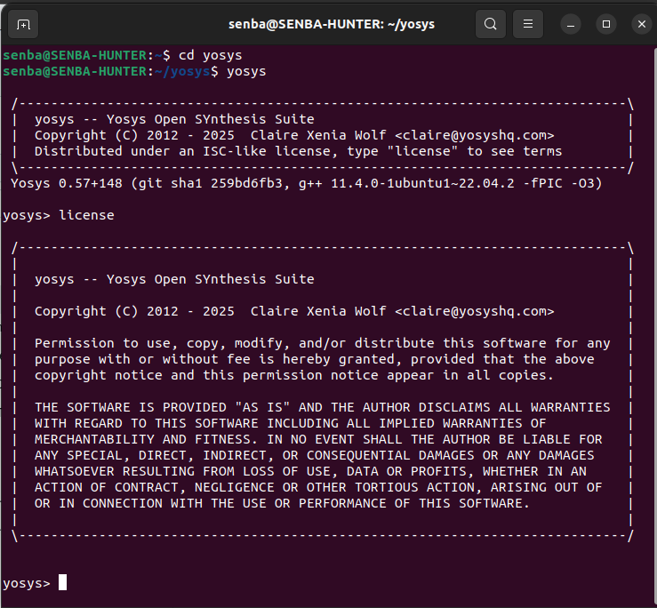

# 🖥️ Tool Setup & Installation — Week0

<div align="center">




</div>

---

## 🚀 Introduction
This task focused on preparing the **SoC design environment** by installing and verifying the essential **open-source EDA tools** required for RTL-to-GDSII flow.  
All tools were successfully set up and tested to ensure a smooth workflow for upcoming design tasks.  

---

## 🛠️ Installed Tools

| Tool        | Purpose                                 | Status |
|-------------|-----------------------------------------|--------|
| **Yosys**   | RTL synthesis & logic optimization      | ✅ Installed |
| **Icarus Verilog (iverilog)** | Verilog simulation & compilation | ✅ Installed |
| **GTKWave** | Waveform viewer & signal analysis       | ✅ Installed |
| **Ngspice** | Analog & mixed-signal circuit simulation | ✅ Installed |
| **Magic VLSI** | Layout design & DRC verification      | ✅ Installed |
| **OpenLane** | End-to-end RTL → GDSII design flow     | ✅ Installed |
| **Docker**   | Containerization platform for flows    | ✅ Installed |

---

## 🔑 Key Highlights
- Installed **full EDA toolchain** required for chip design.  
- Verified **functional correctness** of each tool.  
- Set up **OpenLane environment with Docker** for automated RTL-to-GDSII flows.  
- Ensured compatibility for **future RTL, synthesis, and layout tasks**.  

---

## 📂 Environment Setup Snapshot
```bash
# Example check for yosys
$ yosys -V
Yosys 0.26+ (gcc 11.4.0, clang 14.0.6)

# Example check for iverilog
$ iverilog -V
Icarus Verilog version 12.0

# Example check for gtkwave
$ gtkwave --version
GTKWave Analyzer v3.3.118

